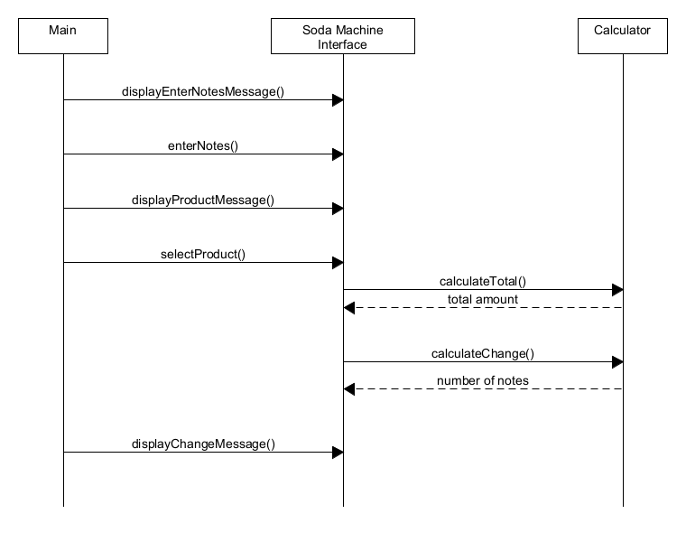

# Coin-Operated-Soda-Machine
A simple program demonstrating OOP.

## How do you design a Coin-Operated Soda Machine?
UML flow diagram: 

## Requirement statement (*):
 1. Accepts notes of 10.000, 20.000, 50.000, 100.000, 200.000 VND 
 2. Allow user to select products Coke (10.000), Pepsi (10.000), Soda (20.000)
 3. Allow the user to receive a refund by canceling the request. 
 4. Release the selected product and remaining change if any
